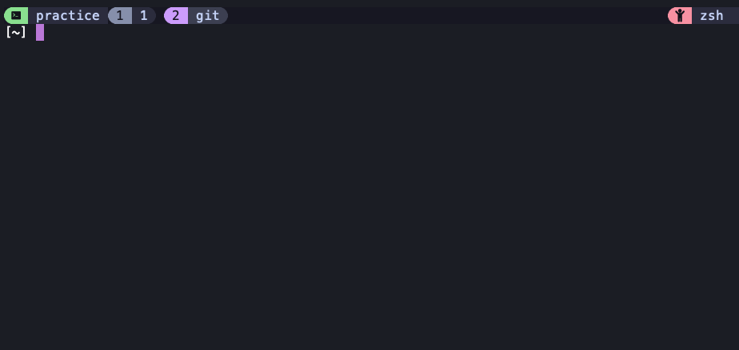
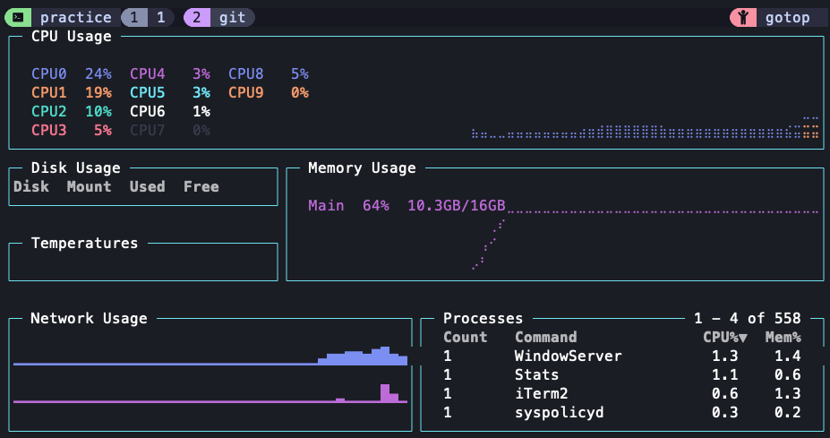

# Step-by-Step Guide to Setting up Tmux and Gotop with Git Integration

## Overview
This guide will walk you through the process of setting up Tmux with a minimalistic theme, integrating Git branch information in the status bar, and installing Gotop for system monitoring. Screenshots are provided to illustrate the final result.

---

## Prerequisites

- **Operating System**: Linux/MacOS
- **Shell**: zsh (or any shell of your choice)
- **Dependencies**:
  - Git
  - Tmux (version >= 3.2)
  - Gotop (system monitoring tool)

---

## Step 1: Install Dependencies

1. **Install Git**:
   ```bash
   sudo apt install git        # For Debian-based systems
   brew install git            # For macOS with Homebrew
   ```

2. **Install Tmux**:
   ```bash
   sudo apt install tmux       # For Debian-based systems
   brew install tmux           # For macOS with Homebrew
   ```

3. **Install Gotop**:
   ```bash
   brew install gotop          # For macOS
   ```
   For other systems, refer to [Gotop's official repository](https://github.com/xxx/gotop).

---

## Step 2: Configure Tmux

1. **Clone Tmux Plugin Manager**:
   ```bash
   git clone https://github.com/tmux-plugins/tpm ~/.tmux/plugins/tpm
   ```

2. **Create/Update `~/.tmux.conf`**:
   Add the following configuration:
   ```bash
   # Tmux Configuration File
   set -g prefix C-a
   unbind C-b
   bind C-a send-prefix

   # Enable Mouse Support
   set -g mouse on

   # Plugins
   set -g @plugin 'tmux-plugins/tpm'
   set -g @plugin 'tmux-plugins/tmux-yank'

   # Git Integration in Status Bar
   set -g status-right '#(git rev-parse --abbrev-ref HEAD 2>/dev/null || echo "No Git Repo")'

   # Initialize TPM (Tmux Plugin Manager)
   run '~/.tmux/plugins/tpm/tpm'
   ```

3. **Source Configuration**:
   Reload the Tmux configuration:
   ```bash
   tmux source-file ~/.tmux.conf
   ```

4. **Install Plugins**:
   Press `prefix + I` (C-a + I) to install plugins via TPM.

---

## Step 3: Run Gotop for System Monitoring

1. Launch Gotop:
   ```bash
   gotop
   ```

2. Observe the CPU, Memory, and Network statistics in a visually appealing interface.

---

## Screenshots

### Final Tmux Setup:


### Gotop in Action:


---

## Troubleshooting

- **Tmux does not display Git branch**:
  Ensure Git is installed and the directory is a valid Git repository.

- **Gotop not installed**:
  Follow the official documentation of Gotop for platform-specific installation.

---

## References

- [Tmux Plugin Manager](https://github.com/tmux-plugins/tpm)
- [Gotop](https://github.com/xxx/gotop)

---

Enjoy your minimalistic and functional Tmux + Gotop setup!
